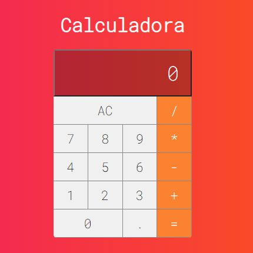

<h1 align="center">
 # react-curso_Redux-fundamentosUdemy
</h1>

  <a href="#-tecnologias">Tecnologias</a>&nbsp;&nbsp;&nbsp;|&nbsp;&nbsp;&nbsp;
  <a href="#-projeto">Projeto</a>&nbsp;&nbsp;&nbsp;|&nbsp;&nbsp;&nbsp;
  <a href="#-projeto">Desafios</a>&nbsp;&nbsp;&nbsp;|&nbsp;&nbsp;&nbsp;
  <a href="#-como-executar">Como executar</a>&nbsp;&nbsp;&nbsp;|&nbsp;&nbsp;&nbsp;
  <a href="#-licença">Licença</a>

  

 

## ✨ Tecnologias

Este é um Projeto [Next.js](https://nextjs.org/) inicializado com [`yarn create react-app`] e desenvolvido com as seguintes tecnologias.

- [React js](https://reactjs.org)

## 💻 Projeto

Calculadora.

  

## 🚀 Como executar

- Clone o repositório
- Instale as dependências com `Yarn install` ou `npm install`
- Abra o terminal e inicie o servidor do seu editor [`VScode`](https://code.visualstudio.com/) com `yarn start` ou `npm start`

Abra [http://localhost:3000](http://localhost:3000) com seu navegador para ver o resultado.

A página é atualizada automaticamente conforme você edita o arquivo.

## 📄 Licença

Esse projeto está sob a licença MIT. Veja o arquivo [LICENSE](LICENSE.md) para mais detalhes.

---