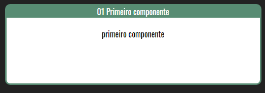
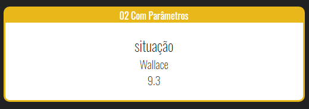
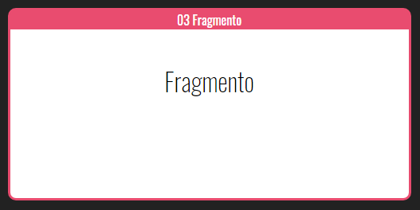
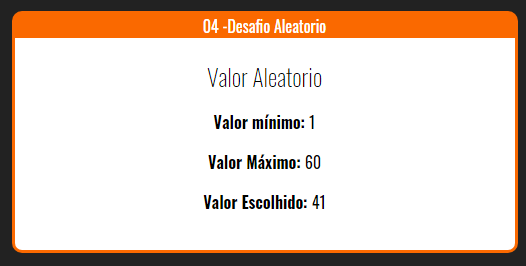
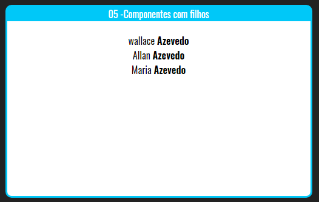
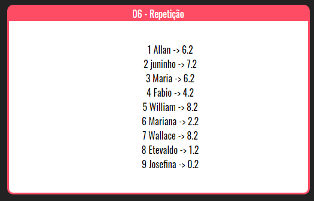
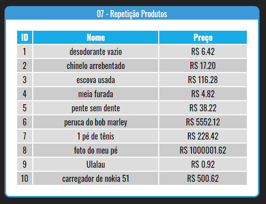
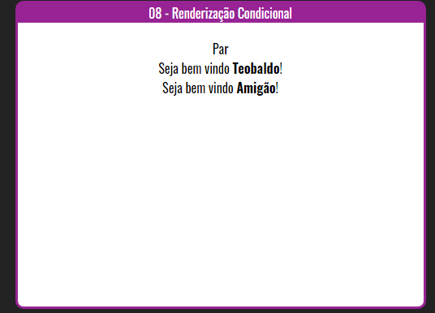
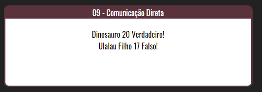
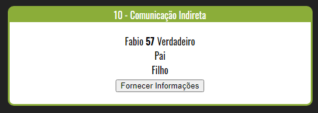

<h1 align="center">
 # react-curso_Redux-fundamentosUdemy
</h1>

  <a href="#-tecnologias">Tecnologias</a>&nbsp;&nbsp;&nbsp;|&nbsp;&nbsp;&nbsp;
  <a href="#-projeto">Projeto</a>&nbsp;&nbsp;&nbsp;|&nbsp;&nbsp;&nbsp;
  <a href="#-projeto">Desafios</a>&nbsp;&nbsp;&nbsp;|&nbsp;&nbsp;&nbsp;
  <a href="#-como-executar">Como executar</a>&nbsp;&nbsp;&nbsp;|&nbsp;&nbsp;&nbsp;
  <a href="#-licença">Licença</a>

  

 

## ✨ Tecnologias

Este é um Projeto [Next.js](https://nextjs.org/) inicializado com [`yarn create react-app`] e desenvolvido com as seguintes tecnologias.

- [React js](https://reactjs.org)
- [Webpack](https://)
- [Redux-Form](https://)
- [MongoDB](https://)
- [Express](https://)
- [Node](https://)

## 💻 Projeto

Vários exercícios para ensinar os fundamentos de Webpack, React, Redux e todo o ecossistema envolvido no processo, desde o básico, mostrando os primeiros passos, até assuntos complexos como geração de formulários dinâmicos e middlewares. Inclusive tecnologias de backend, como Node, Express e MongoDB.

## 🏋🏼‍♀️ Desafios 

 Crie seu primeiro componete em React

  

 Criando nossos primeiros parametros em React

  

 Criando nosso primeiro Fragmento em React

  

Desafio criar um número aleatorio de 1 a 60

  

Componetes com filhos

  

Componetes com repetição

  

Componetes com repetição de Produtos

  

Renderizando com condicional

  

Comunicação Direta

  

Comunicação Indireta

  

## 🚀 Como executar

- Clone o repositório
- Instale as dependências com `Yarn install` ou `npm install`
- Abra o terminal e inicie o servidor do seu editor [`VScode`](https://code.visualstudio.com/) com `yarn start` ou `npm start`

Abra [http://localhost:3000](http://localhost:3000) com seu navegador para ver o resultado.

A página é atualizada automaticamente conforme você edita o arquivo.

## 📄 Licença

Esse projeto está sob a licença MIT. Veja o arquivo [LICENSE](LICENSE.md) para mais detalhes.

---
# Lembrando que o conteúdo desse repositorio e apenas para apredizagem 

 
